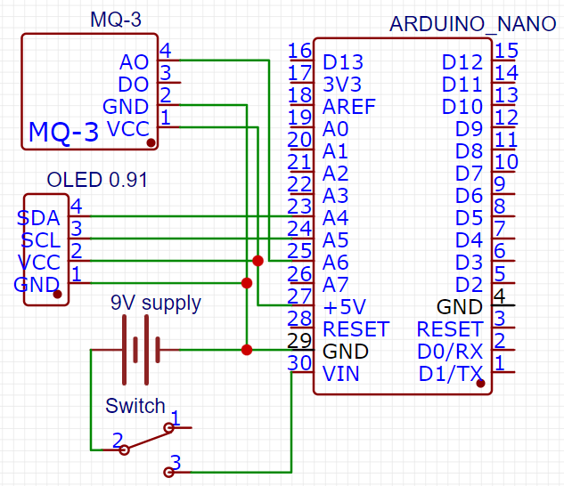
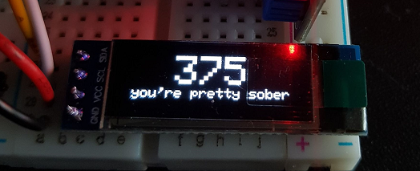
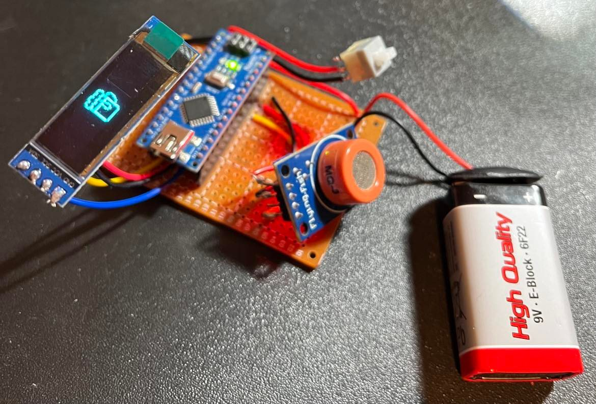
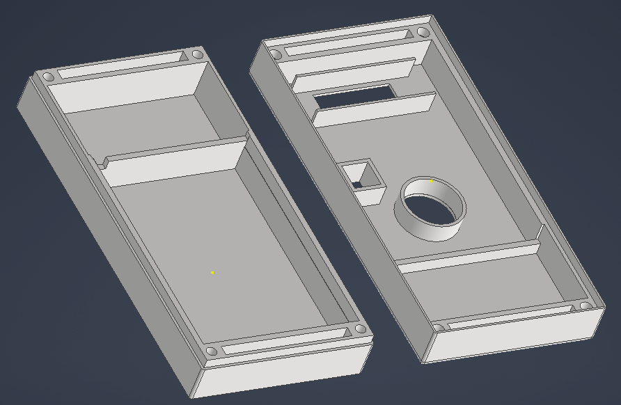
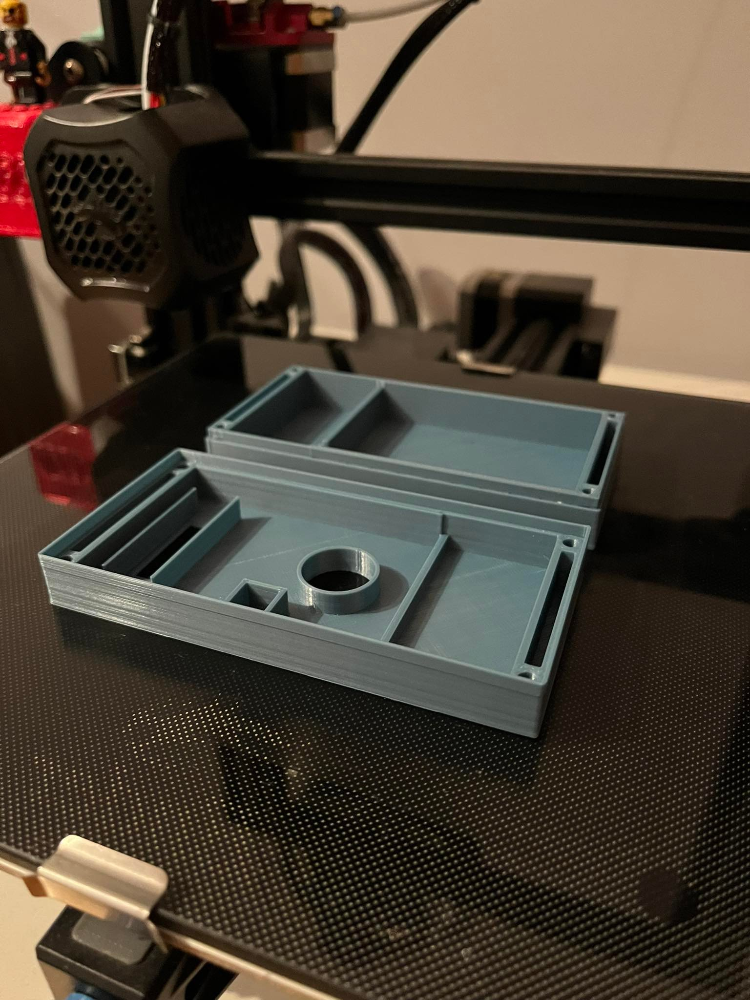
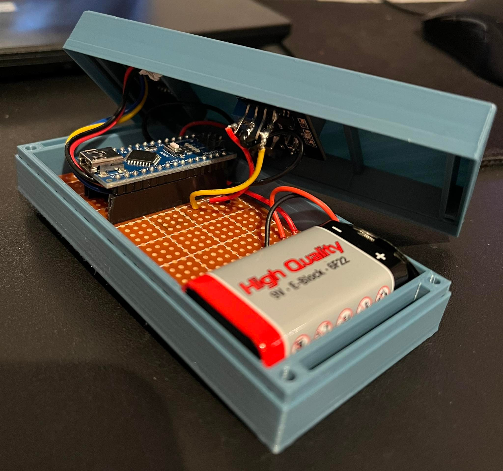
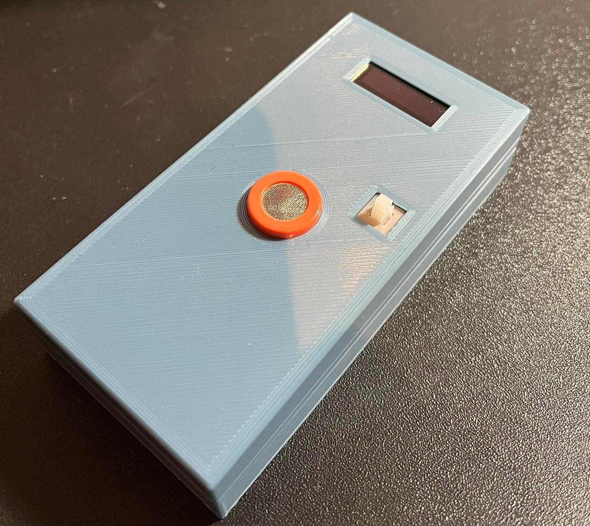

# breathalyzer
## Components
- Arduino nano
- 0.91" OLED with I2C interface
- MQ-3 alcohol sensor
- power source - 9V battery

## Electrical diagram

## Wiring the prototype
To start programming I firstly built a prototype using breadboard. (I skipped the switch which cut the power off, because during programming I am powering whole device via USB)

## Programming

According to datasheet first important thing is preheat the sensor, so I set the preheat time to 2minutes (after 2 minutes sensor reading has stopped decreasing).
For the preheat time I proggramed a fancy animated loading screen.

After this I used simple analog read to read the value from sensor every 500ms. I am using millis() function to measure time between program loops - thanks to this I won't stop whole program using delay() function (multithreading 😎).

To print every text horizontally centered I created the `print_in_centre()` function.

Everything printed on the screen is managed by `print_reading()` function.

It's really hard to calibrate properly this sensor - so it could show per mille value. By now I just calibrated it as good as I am able to in my home conditions. I designed housing in such a way that I will be able to calibrate it in the future if needed.

## Soldered device

## Housing

I designed housing for the breathalyzer using Autodesk Inventor in the most precise way so no glue is needed to assemble my device.

In the next step I 3D prineted the enclosure using my Ender 3 V2 printer.

## Assembling

Finally I was able to assemble whole project

