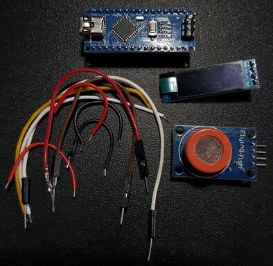
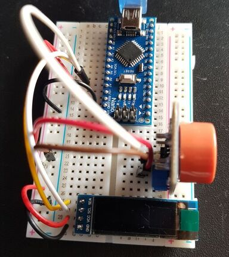
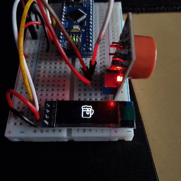

# breathalyzer - work in progress...
## Components
- Arduino nano
- 0.91" OLED with I2C interface
- MQ-3 alcohol sensor
- power source - 9V battery

## Electrical diagram

## Wiring the prototype
To start programming I firstly built a prototype using breadboard. (I skipped the buttons which cut the power off, because during programming I am powering whole device via USB)

## Programming

According to datasheet first important thing is preheat the sensor, so I set the preheat time to 2minutes (after 2 minutes sensor reading has stopped decreasing).
For the preheat time I proggramed a fancy animated loading screen.

After this I used simple analog read to read the value from sensor every 500ms. I am using millis() function to measure time between program loops - thanks to this I won't stop whole program using delay() function (multithreading 😎).

To print every text horizontally centered I created the `print_in_centre()` function.